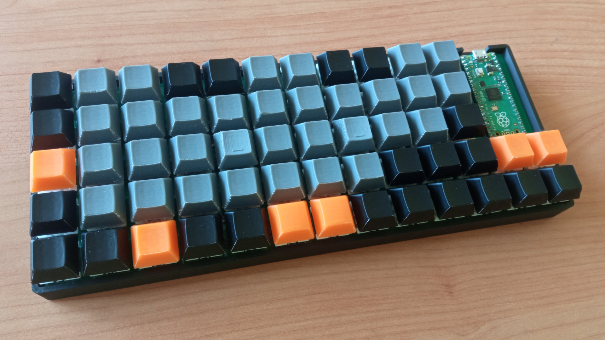

# Oxide59
A 59-key USB keyboard built with Raspberry Pi Pico



## Default layout
|         |       |       |       |       |       |       |       |       |       |        |       |                  |
|---------|-------|-------|-------|-------|-------|-------|-------|-------|-------|--------|-------|------------------|
| \`~     | 1! F1 | 2@ F2 | 3# F3 | 4$ F4 | 5% F5 | 6^ F6 | 7& F7 | 8* F8 | 9( F9 | 0) F10 |       |                  |
| Tab     | Q     | W     | E     | R     | T     | Y     | U     | I     | O     | P  F11 |       |                  |
| Esc     | A     | S     | D     | F     | G     | H ←   | J ↓   | K ↑   | L →   | ;: F12 |       |                  |
| Shift   | Z     | X     | C     | V     | B     | N     | M     | ,<    | .>    | /?     | Enter | Backspace Delete |
| Control | Fn    | Super | Alt   | AltGr | Space | Space | [{    | ]}    | \\\|  | '"     | -_    | =+               |

## Bill of materials
| Name                   | Details                          | Quantity |
|------------------------|----------------------------------|----------|
| 3D printing filament   | SUNLU PLA+ 2.0 was used          | A/R      |
| Solder                 |                                  | A/R      |
| PCB                    | 1.2 mm thickness                 | 1        |
| Raspberry Pi Pico      |                                  | 1        |
| USB-A to Micro-B cable |                                  | 1        |
| Male pin header        | 2.54 mm pitch, 20 pins           | 2        |
| M2 screw               | Pan head, 6 mm long              | 8        |
| M2 brass insert        | 6 mm long, 3.5 mm outer diameter | 8        |
| Cherry MX switch       |                                  | 59       |
| 1N4148 diode           |                                  | 59       |

## Firmware
1. Install Pico SDK and Picotool.
2. Navigate to the ```firmware``` directory and run:
```
mkdir build
cd build
cmake ..
make -j$(nproc)
```
3. Plug the pico in while holding the BOOTSEL button and run these with root privileges:
```
picotool load firmware.uf2
picotool reboot
```
